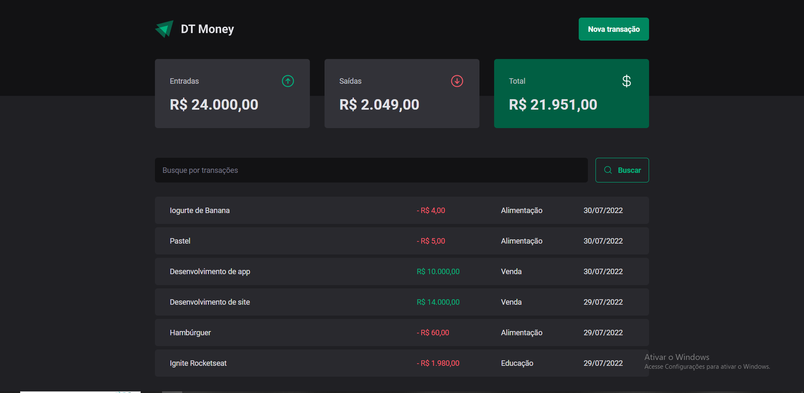
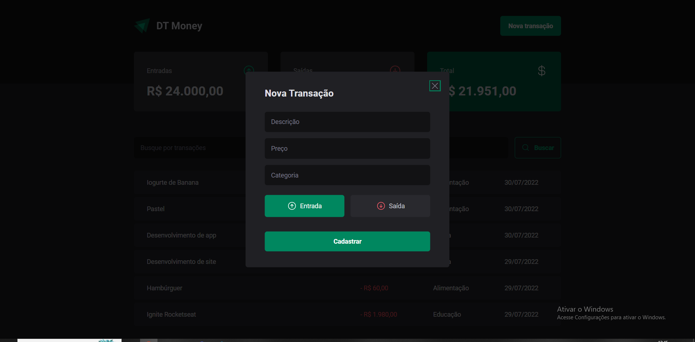

  <h1 align="center"><a href="https://ignite-dt-money.netlify.app/">DT Money  </a></h1>

  

  

Este é o resultado de um estudo aprofundado de React.js.

___

## 💻 Sobre
A ideia deste projeto é criar um controle financeiro para o usuário. Nele o usuário pode adicionar as entradas e saídas financeiras do seu dia-a-dia. É possível ainda utilizar o campo de busca da página para filtrar por itens ou categorias específicas.

Por "trás dos panos" o projeto apresenta diversas funcionalidades, fazendo uso do React Hook Form e Zod nos formulários e utilizando Context para facilitar o uso de variáveis. O projeto possuí ainda otimizações para evitar renderizações desnecessárias nos componentes.

___

## 🎨 Layout
A página em formato desktop é vista na imagem abaixo:

___

## 🛠 Tecnologias

As seguintes tecnologias foram empregadas na criação deste projeto:

- [ReactJs](https://reactjs.org)
- [TypeScript](https://www.typescriptlang.org/)
- [Vite](https://vitejs.dev/)
- [React Hook Form](https://react-hook-form.com/)
- [Styled Components](https://styled-components.com/)
- [Zod](https://zod.dev/)

___

## 🚀 Resultado

___

[O resultado FINAL pode ser visto aqui](https://ignite-dt-money.netlify.app/)

___

---
